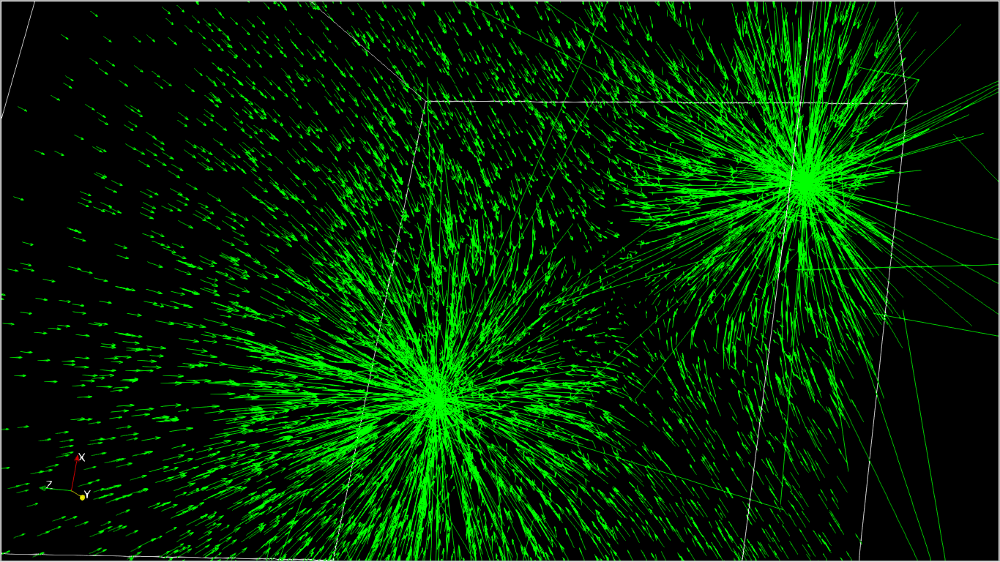
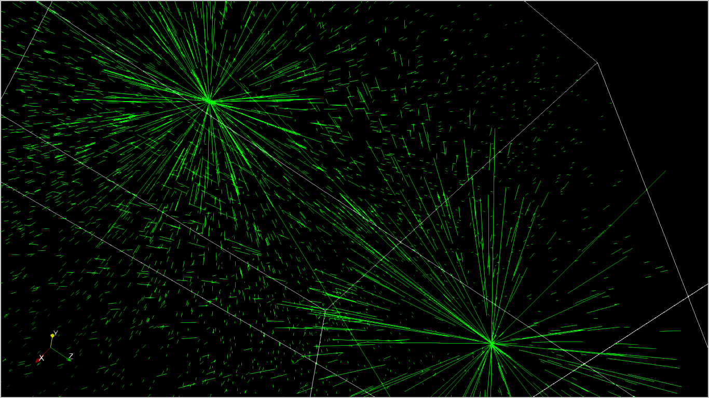
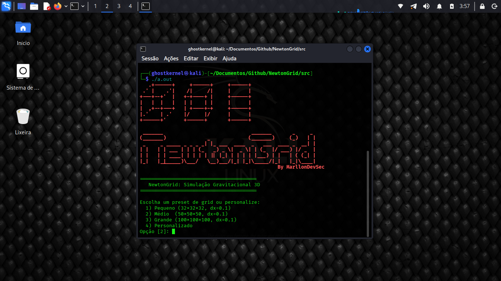
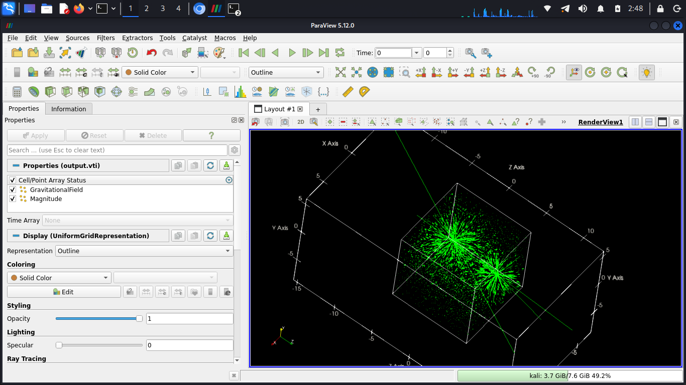

# NewtonGrid — Simulação Gravitacional 3D

## Descrição

NewtonGrid é um simulador de campos gravitacionais 3D escrito em C++ que calcula e visualiza campos vetoriais gerados por massas pontuais em um domínio discreto. O projeto adota uma abordagem de computação científica para resolver a Lei da Gravitação Universal de Newton em grades cartesianas regulares, com exportação para formatos compatíveis com o **ParaView**.

---

## Características principais

* **Grade cartesiana 3D flexível**: domínios personalizáveis (dimensões, espaçamento e origem).
* **Múltiplos modos de configuração**: massas definidas manualmente, de forma simétrica, aleatória ou via arquivo.
* **Física realista**: implementação da Lei da Gravitação Universal com *softening* para estabilidade numérica.
* **Exportação VTK**: geração de arquivos `.vti` (VTK Image Data) para visualização 3D profissional.
* **Interface interativa**: menu em terminal com entrada passo a passo e validação de dados.
* **Multiplataforma**: Linux, macOS e Windows (cores ANSI/VT).


*Campo gravitacional gerado por massas pontuais — visualização de magnitude.*


*Outra vista do campo, usada para validação visual.*

---

## Estrutura do projeto

```
src/
├── NewtonGrid.cpp              # Programa principal com interface interativa
├── data/
│   ├── Grid.hpp               # Representação de grades 3D
│   └── FieldData.hpp          # Armazenamento de campos vetoriais
├── physics/
│   └── GravitationalField.hpp # Cálculo de campos gravitacionais
├── io/
│   └── VTIWriter.hpp          # Exportação VTK Image Data (.vti)
└── output.vti                 # Arquivo gerado após execução
```

---

## Arquitetura de classes

### 1. `Grid` (`Grid.hpp`)

Representa um domínio cartesiano regular 3D.

**Características**:

* Representação sempre 3D (2D via `nz = 1`).
* Memória contígua com ordenamento *F-contiguous* (x mais rápido).
* Interface imutável após construção.
* Conversões eficientes entre índices discretos, lineares e coordenadas físicas.
* Compatível com `VTK ImageData`.

**Métodos principais**:

* `dimensions()`, `spacing()`, `origin()`
* `linear_index(i, j, k)`
* `discrete_indices(idx)`
* `physical_to_discrete(x, y, z)`
* `discrete_to_physical(i, j, k)`
* `for_each_point(func)`

---

### 2. `FieldData` (`FieldData.hpp`)

Armazena um campo vetorial 3D definido sobre um `Grid`.

**Características**:

* Armazenamento separado por componentes (`gx`, `gy`, `gz`).
* Operações em massa (zerar, preencher, aplicar funções).
* Cálculo de grandezas derivadas (magnitude, norma L2).
* Conversão para *Array of Structures* (AOS) para exportação.

**Métodos principais**:

* `allocate(grid, zero_init)`
* `get_vector(idx)`, `set_vector(idx, vec)`
* `magnitude(idx)`
* `max_magnitude()`, `min_positive_magnitude()`, `norm_l2()`
* `to_aos()`

---

### 3. `GravitationalField` (`GravitationalField.hpp`)

Calcula campos gravitacionais newtonianos gerados por massas pontuais.

**Características**:

* Implementação da Lei da Gravitação Universal com *softening*.
* Suporte a múltiplas massas.
* *Thread-safe* para leitura.
* Preparado para otimizações (SIMD, OpenMP).

**Métodos principais**:

* `add_mass(x, y, z, value)`
* `compute(field)`
* `compute_optimized(field)`
* `compute_magnitude_only(field)`
* `compute_potential(field)`

---

### 4. `VTIWriter` (`VTIWriter.hpp`)

Exporta os dados para o formato **VTK ImageData (.vti)**.

**Características**:

* Arquivos XML compatíveis com ParaView.
* Exportação do campo vetorial e da magnitude.
* Precisão configurável (padrão: 15 dígitos).
* Formato ASCII (legível).

**Métodos principais**:

* `write(filename, grid, field)`
* `set_precision(precision)`
* `enable_magnitude(enabled)`
* `enable_vector_field(enabled)`

---

## Pré-requisitos

* Compilador **C++17** (g++ 7+, clang 5+, MSVC 2019+)
* Terminal com suporte a cores ANSI
* **ParaView** (opcional, para visualização)

---

## Compilação

### Linux / macOS

```bash
# g++
g++ -std=c++17 -O2 -I. NewtonGrid.cpp -o NewtonGrid -pthread

# clang
clang++ -std=c++17 -O2 -I. NewtonGrid.cpp -o NewtonGrid -pthread
```

### Windows

```bash
# MinGW
g++ -std=c++17 -O2 -I. NewtonGrid.cpp -o NewtonGrid.exe

# MSVC (Developer Command Prompt)
cl /EHsc /std:c++17 /O2 NewtonGrid.cpp
```

---

## Uso

### Execução interativa


*Tela do programa em execução mostrando o menu interativo.*

```bash
./NewtonGrid
```

O programa guia o usuário por um menu interativo:

1. Escolha do grid (preset ou personalizado)
2. Definição de `G` e *softening*
3. Configuração das massas
4. Cálculo do campo
5. Exportação para `output.vti`

---

### Execução não interativa (pipeline)

```bash
echo -e "2\n1.0\n0.001\n1\n2\n1.0 0.0 0.0 5.0\n-1.0 0.0 0.0 5.0" | ./NewtonGrid
```

---

## Visualização dos resultados


*Visualização do editor gráfico usado para inspecionar e ajustar a saída VTI.*

1. Instale o **ParaView**
2. Abra `output.vti`
3. Aplique filtros como **Glyph**, **Contour** ou **Slice**
4. Ajuste escala, cores e magnitude conforme necessário

---

## Formato do arquivo de massas

```text
# x y z massa
0.0 0.0 0.0 1.0
1.0 0.0 0.0 0.5
-1.0 0.0 0.0 0.5
```

---

## Exemplos de casos de uso

1. **Sistema Binário**

```bash
./NewtonGrid
# Escolha: Grid Médio (50x50x50)
# G = 1.0, softening = 0.001
# Massas: Simétrico, 2 massas, distância = 3.0, massa = 5.0
```

2. **Aglomerado Estelar**

```bash
./NewtonGrid
# Grid: Grande (100x100x100)
# Massas: Aleatório, 10 massas, distância mínima = 1.0, massa = variável
```

3. **Campo de Poço Único**

```bash
./NewtonGrid
# Grid: Personalizado (nx=64, ny=64, nz=1, dx=dy=0.1, dz=1.0)
# Massas: Manual, posição (0,0,0), massa = 10.0
```

---

## Saída do programa


*Imagem representativa da saída gerada (vetores e magnitudes).*

O programa gera:

* Estatísticas do Grid: Dimensões, espaçamento, origem, pontos totais
* Lista de Massas: Posições e valores de todas as massas
* Estatísticas do Campo: Magnitude máxima/mínima, norma L2
* Arquivo `output.vti`: Dados em formato VTK para visualização
* Exemplos de Validação: Valores do campo em alguns pontos para verificação

---

## Física implementada

### Lei da Gravitação Universal

[ \vec{g} = -G \cdot m \cdot \frac{\vec{r}}{(|r|^2 + \varepsilon^2)^{3/2}} ]

Onde:

* `G`: constante gravitacional
* `\vec{r}`: vetor deslocamento
* `\varepsilon`: parâmetro de *softening*

---
